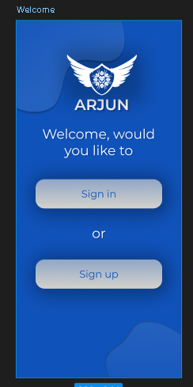
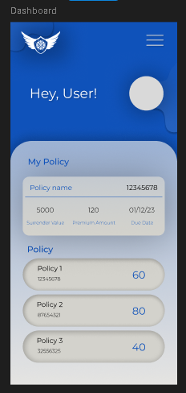
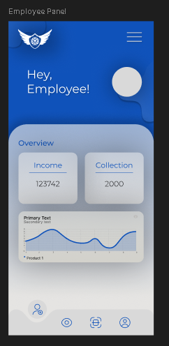
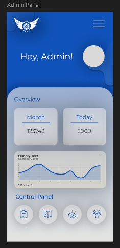

# ACS – Arjun Consultancy Software
### LIC Policy & Agency Management System
 
> ⚠️ **Note:** This is a client project built for Arjun Consultancy, Vadodara. Source code is kept private due to client confidentiality. This repository documents the architecture, features, and technical decisions behind the application.
 
---
 
## Overview
 
ACS is a full-stack cross-platform mobile application built for a real LIC (Life Insurance Corporation) agency. It digitises and centralises the entire agency workflow — from customer policy tracking to employee management to admin commission handling — into one unified platform.
 
The application serves **4 distinct user roles** across **45+ screens**, with each role having its own dashboard, permissions, and data access.
 
---
 
## Screenshots
 
### Splash & Authentication


 
### User Dashboard

 
### Employee Panel

 
### Admin Panel

 
> *Screenshots shown are UI design mockups. Live app data is confidential.*
 
---
## Key Features
 
### Authentication System
- OTP-based phone number authentication
- Role-based login routing — each role lands on a different dashboard
- Remember me functionality
- Secure sign up with username and phone verification
### 4-Role Access System
 
| Role | Access Level | Primary Function |
|---|---|---|
| **Super Admin** | Highest | Full system control, all data, all users |
| **Admin** | High | Commission tracking, team overview, control panel |
| **Employee** | Medium | Income tracking, collection management, assigned customers |
| **User (Customer)** | Standard | View own policies, premium details, due dates |
 
### User (Customer) Dashboard
- Personal policy overview
- Policy details — surrender value, premium amount, due dates
- Multiple policy tracking in one view
- Profile management
### Employee Panel
- Income and collection overview
- Performance analytics with trend charts
- Assigned customer management
- Personal profile and records
### Admin Panel
- Monthly and daily collection overview
- Team performance analytics
- Control panel for system management
- Commission tracking and reporting
### Super Admin
- Full agency oversight
- All employee, admin, and customer data
- System-wide reporting and analytics
---
 
## Technical Architecture
 
```
ACS Application
├── Presentation Layer       → Flutter UI, screens, widgets, themes
├── Business Logic Layer     → State management, controllers, validation
├── Data Layer               → Repository pattern, API calls, local storage
└── Database Layer           → Supabase (PostgreSQL), real-time sync
```
 
### Why 3-Layer Architecture?
- **Separation of concerns** — UI changes don't break business logic
- **Testability** — each layer can be tested independently
- **Scalability** — new features can be added without touching unrelated code
- **Maintainability** — client can request changes to one layer without risk
---
 
## Tech Stack
 
| Category | Technology |
|---|---|
| **Framework** | Flutter (Dart) |
| **Backend** | Supabase |
| **Database** | PostgreSQL |
| **Authentication** | Supabase Auth (OTP / Phone) |
| **State Management** | Provider / GetX |
| **Charts & Analytics** | FL Chart |
| **Platform** | Android & iOS (Cross-platform) |
 
---
 
## Database Design
 
The database is structured to handle multi-role relationships efficiently:
 
- `users` — customer profiles and authentication records
- `policies` — policy numbers, premium amounts, surrender values, due dates
- `employees` — staff details, income records, collection data
- `admins` — admin profiles, commission records, team assignments
- `transactions` — payment records and collection history
- `roles` — role definitions and permission mappings
**Key design decisions:**
- Row-level security (RLS) via Supabase ensures each role only accesses permitted data
- Real-time subscriptions for live dashboard updates
- Normalised schema to avoid data duplication across 45+ screens
---
 
## Screens Overview (45+ total)
 
**Authentication Flow (3 screens)**
Welcome → Sign In / Sign Up → OTP Verification
 
**User Flow (10+ screens)**
Dashboard → Policy List → Policy Detail → Profile → Settings
 
**Employee Flow (12+ screens)**
Dashboard → Income Overview → Collection Tracker → Customer List → Customer Detail → Profile
 
**Admin Flow (12+ screens)**
Dashboard → Overview → Control Panel → Team Management → Commission Tracker → Reports
 
**Super Admin Flow (10+ screens)**
Full system dashboard → All user management → Agency-wide reporting
 
---
 
## Challenges Solved
 
**1. Multi-role routing**
Built a dynamic routing system that reads the user's role from Supabase on login and routes them to the correct dashboard — without hardcoding role checks across every screen.
 
**2. Real-time data sync**
Used Supabase's real-time subscriptions so admin dashboards update live when employees log collections — no manual refresh needed.
 
**3. OTP Authentication without Firebase**
Implemented phone-based OTP authentication entirely through Supabase Auth, keeping the backend unified in one platform.
 
**4. Consistent UI across 45+ screens**
Built a custom theme system and reusable widget library so all screens follow the same design language — reducing development time and ensuring visual consistency.
 
---
 
## Project Status
 
| Module | Status |
|---|---|
| Authentication System | ✅ Complete |
| User Dashboard | ✅ Complete |
| Employee Panel | ✅ Complete |
| Admin Panel | ✅ Complete |
| Super Admin Panel | ✅ Complete |
| Policy Management | ✅ Complete |
| Analytics & Charts | ✅ Complete |
| Real-time Sync | ✅ Complete |
 
---
 
## About the Developer
 
Built by **Yuvrajsinh Chauhan** — developer responsible for:
- Requirement gathering and analysis
- UI/UX design (all 45+ screens)
- Frontend development (Flutter/Dart)
- Backend setup and configuration (Supabase)
- Database schema design (PostgreSQL)
- Testing and deployment
**Connect:**
- LinkedIn: [yuvrajsinh-chauhan](https://www.linkedin.com/in/yuvrajsinh-chauhan-40a69a238)
- GitHub: [yuvrajsinh-chauhan-dev](https://github.com/yuvrajsinh-chauhan-dev)
- Email: chauhanyuvraj666@gmail.com
---
 
*For demo access or technical discussion, feel free to reach out via LinkedIn or email.*
 


